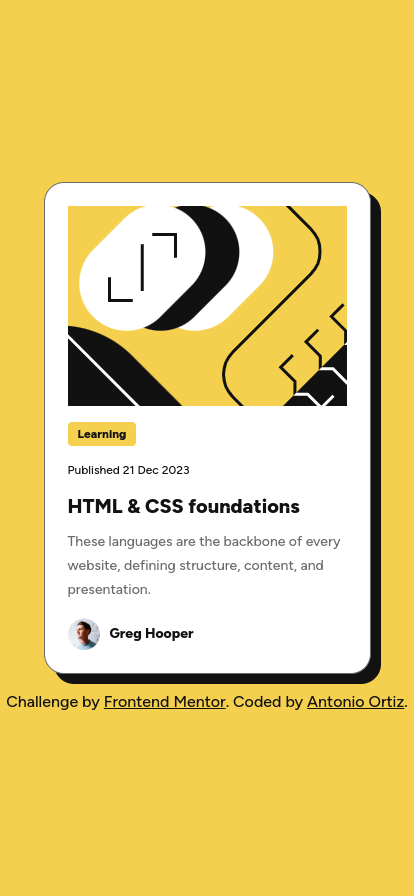

# Frontend Mentor - Blog preview card solution

This is a solution to the [Blog preview card challenge on Frontend Mentor](https://www.frontendmentor.io/challenges/blog-preview-card-ckPaj01IcS). Frontend Mentor challenges help you improve your coding skills by building realistic projects.

## Table of contents

- [Overview](#overview)
  - [The challenge](#the-challenge)
  - [Screenshot](#screenshot)
  - [Links](#links)
- [My process](#my-process)
  - [Built with](#built-with)
  - [What I learned](#what-i-learned)
- [Author](#author)

## Overview

### The challenge

Users should be able to:

- See hover and focus states for all interactive elements on the page

### Screenshot

### Links

- Solution URL: [https://github.com/ortiz-antonio/blog-preview-card](https://github.com/ortiz-antonio/blog-preview-card)
- Live Site URL: [https://ortiz-antonio.github.io/blog-preview-card/](https://ortiz-antonio.github.io/blog-preview-card/)

## My process

### Built with

- Semantic HTML5 markup
- SCSS
- nunjucks
- Flexbox
- Mobile-first workflow

### What I learned

In this proyect, I tried to implement better my sass setup, also first I used clamp for the container width and for the fonts on tag, date, title and description, So I changed to a media query, It makes more sense because I'm using the same breakpoint and only I change one value, not using different transition values on a clamp function.
Also I run some accesibility test.

## Author

- Website - [Antonio Ortiz](https://ortiz.studio)
- Frontend Mentor - [@ortiz-antonio](https://www.frontendmentor.io/profile/ortiz-antonio)
